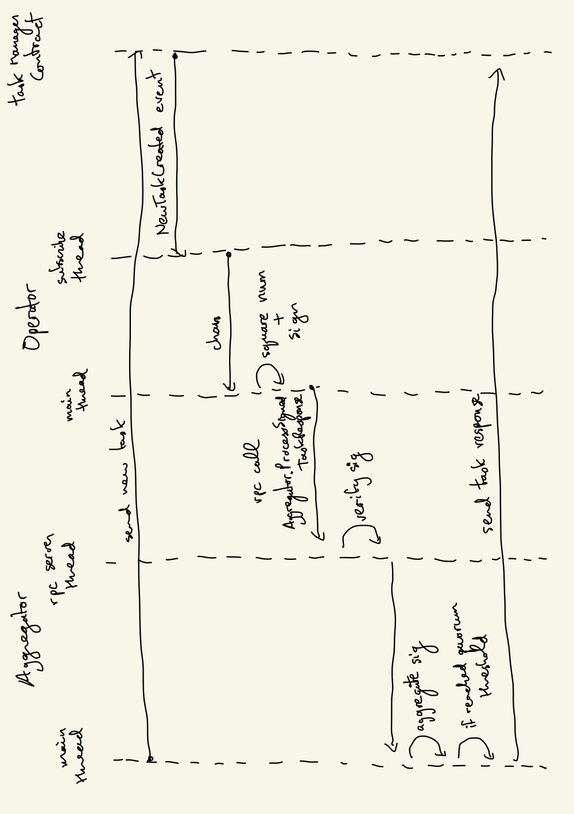

# Incredible Squaring AVS

<b> Do not use it in Production, testnet only. </b>

Basic repo demoing a simple AVS middleware with full eigenlayer integration.

## Running via make

This simple session illustrates the basic flow of the AVS. The makefile commands are hardcoded for a single operator, but it's however easy to create new operator config files, and start more operators manually (see the actual commands that the makefile calls).

Start anvil in a separate terminal:

```bash
make start-anvil-chain-with-el-and-avs-deployed
```

The above command starts a local anvil chain from a [saved state](./tests/integration/eigenlayer-and-shared-avs-contracts-deployed-anvil-state.json) with eigenlayer and incredible-squaring contracts already deployed (but no operator registered).

Start the aggregator:

```bash
make start-aggregator
```

Register the operator with eigenlayer and incredible-squaring, and then start the process:

```bash
make cli-setup-operator
make start-operator
```

## Running via docker compose

We wrote a [docker-compose.yml](./docker-compose.yml) file to run and test everything on a single machine. It will start an anvil instance, loading a [state](./tests/integration/avs-and-eigenlayer-deployed-anvil-state.json) where the eigenlayer and incredible-squaring contracts are deployed, start the aggregator, and finally one operator, along with prometheus and grafana servers. The grafana server will be available at http://localhost:3000, with user and password both set to `admin`. We have created a simple [grafana dashboard](./grafana/provisioning/dashboards/AVSs/incredible_squaring.json) which can be used as a starting example and expanded to include AVS specific metrics. The eigen metrics should not be added to this dashboard as they will be exposed on the main eigenlayer dashboard provided by the eigenlayer-cli.

## Avs Task Description

The architecture of the AVS contains:

- [Eigenlayer core](https://github.com/Layr-Labs/eigenlayer-contracts/tree/master) contracts
- AVS contracts
  - [ServiceManager](contracts/src/IncredibleSquaringServiceManager.sol) which contains the [slashing](contracts/src/IncredibleSquaringServiceManager.sol#L63) logic.
  - [TaskManager](contracts/src/IncredibleSquaringTaskManager.sol) which contains [task creation](contracts/src/IncredibleSquaringTaskManager.sol#L75) and [task response](contracts/src/IncredibleSquaringTaskManager.sol#L102) logic.
  - The [challenge](contracts/src/IncredibleSquaringTaskManager.sol#L185) logic could be separated into its own contract, but we have decided to include it in the TaskManager for this simple task.
  - Set of [registry contracts](https://github.com/Layr-Labs/eigenlayer-middleware) to manage operators opted in to this avs
- Task Generator
  - in a real world scenario, this could be a separate entity, but for this simple demo, the aggregator also acts as the task generator
- Aggregator
  - aggregates BLS signatures from operators and posts the aggregated response to the task manager
  - For this simple demo, the aggregator is not an operator, and thus does not need to register with eigenlayer or the AVS contract. It's IP address is simply hardcoded into the operators' config.
- Operators
  - Square the number sent to the task manager by the task generator, sign it, and send it to the aggregator


1. A task generator (in our case, same as the aggregator) publishes tasks once every regular interval (say 10 blocks, you are free to set your own interval) to the IncredibleSquaringTaskManager contract's [createNewTask](contracts/src/IncredibleSquaringTaskManager.sol#L78) function. Each task specifies an integer `numberToBeSquared` for which it wants the currently opted-in operators to determine its square `numberToBeSquared^2`. `createNewTask` also takes `quorumNumbers` and `quorumThresholdPercentage` which requests that each listed quorum (we only use quorumNumber 0 in incredible-squaring) needs to reach at least thresholdPercentage of operator signatures.

2. A [registry](https://github.com/Layr-Labs/eigenlayer-middleware/blob/master/src/BLSRegistryCoordinatorWithIndices.sol) contract is deployed that allows any eigenlayer operator with at least 1 delegated [mockerc20](contracts/src/ERC20Mock.sol) token to opt-in to this AVS and also de-register from this AVS.

3. [Operator] The operators who are currently opted-in with the AVS need to read the task number from the Task contract, compute its square, sign on that computed result (over the BN254 curve) and send their taskResponse and signature to the aggregator.

4. [Aggregator] The aggregator collects the signatures from the operators and aggregates them using BLS aggregation. If any response passes the [quorumThresholdPercentage](contracts/src/IIncredibleSquaringTaskManager.sol#L36) set by the task generator when posting the task, the aggregator posts the aggregated response to the Task contract.

5. If a response was sent within the [response window](contracts/src/IncredibleSquaringTaskManager.sol#L119), we enter the [Dispute resolution] period.
   - [Off-chain] A challenge window is launched during which anyone can [raise a dispute](contracts/src/IncredibleSquaringTaskManager.sol#L171) in a DisputeResolution contract (in our case, this is the same as the TaskManager contract)
   - [On-chain] The DisputeResolution contract resolves that a particular operator’s response is not the correct response (that is, not the square of the integer specified in the task) or the opted-in operator didn’t respond during the response window. If the dispute is resolved, the operator will be frozen in the Registration contract and the veto committee will decide whether to veto the freezing request or not.

Below is a more detailed uml diagram of the aggregator and operator processes:



## Integration Tests

See the integration tests [README](tests/integration/README.md) for more details.
