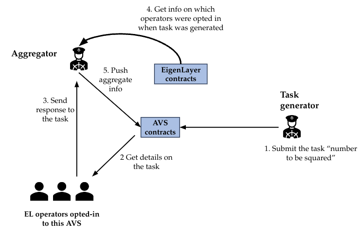
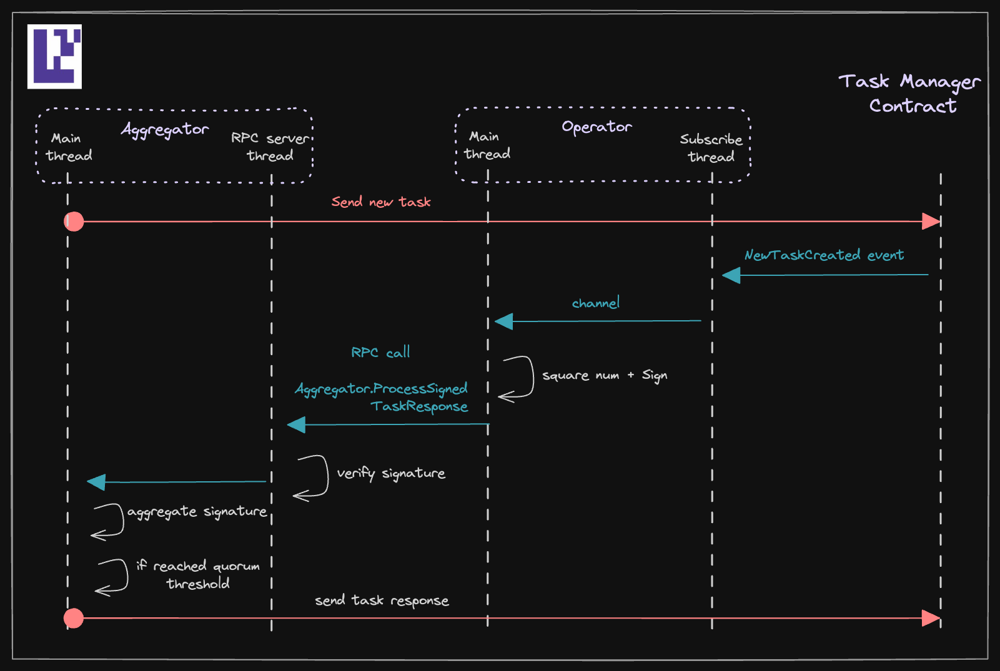

# Incredible Squaring AVS

[](https://goreportcard.com/report/github.com/Layr-Labs/incredible-squaring-avs)

<b> Do not use it in Production, testnet only. </b>

Basic repo demoing a simple AVS middleware with full eigenlayer integration. See this [video walkthrough](https://www.loom.com/share/50314b3ec0f34e2ba386d45724602d76?sid=9d68d8cb-d2d5-4123-bd06-776de2076de0).

## Dependencies

You will need [foundry](https://book.getfoundry.sh/getting-started/installation) and [zap-pretty](https://github.com/maoueh/zap-pretty) and docker to run the examples below.
```
curl -L https://foundry.paradigm.xyz | bash
foundryup
go install github.com/maoueh/zap-pretty@latest
```
You will also need to [install docker](https://docs.docker.com/get-docker/), and build the contracts:
```
make build-contracts
```

## Running via make

This simple session illustrates the basic flow of the AVS. The makefile commands are hardcoded for a single operator, but it's however easy to create new operator config files, and start more operators manually (see the actual commands that the makefile calls).

Start anvil in a separate terminal:

```bash
make start-anvil-chain-with-el-and-avs-deployed
```

The above command starts a local anvil chain from a [saved state](./tests/anvil/avs-and-eigenlayer-deployed-anvil-state.json) with eigenlayer and incredible-squaring contracts already deployed (but no operator registered).

Start the aggregator:

```bash
make start-aggregator
```

Register the operator with eigenlayer and incredible-squaring, and then start the process:

```bash
make start-operator
```

> By default, the `start-operator` command will also setup the operator (see `register_operator_on_startup` flag in `config-files/operator.anvil.yaml`). To disable this, set `register_operator_on_startup` to false, and run `make cli-setup-operator` before running `start-operator`.

## Running via docker compose

We wrote a [docker-compose.yml](./docker-compose.yml) file to run and test everything on a single machine. It will start an anvil instance, loading a [state](./tests/anvil/avs-and-eigenlayer-deployed-anvil-state.json) where the eigenlayer and incredible-squaring contracts are deployed, start the aggregator, and finally one operator, along with prometheus and grafana servers. The grafana server will be available at http://localhost:3000, with user and password both set to `admin`. We have created a simple [grafana dashboard](./grafana/provisioning/dashboards/AVSs/incredible_squaring.json) which can be used as a starting example and expanded to include AVS specific metrics. The eigen metrics should not be added to this dashboard as they will be exposed on the main eigenlayer dashboard provided by the eigenlayer-cli.

## Avs Task Description

The architecture of the AVS contains:

- [Eigenlayer core](https://github.com/Layr-Labs/eigenlayer-contracts/tree/master) contracts
- AVS contracts
  - [ServiceManager](contracts/src/IncredibleSquaringServiceManager.sol) which will eventually contain slashing logic but for M2 is just a placeholder.
  - [TaskManager](contracts/src/IncredibleSquaringTaskManager.sol) which contains [task creation](contracts/src/IncredibleSquaringTaskManager.sol#L83) and [task response](contracts/src/IncredibleSquaringTaskManager.sol#L102) logic.
  - The [challenge](contracts/src/IncredibleSquaringTaskManager.sol#L176) logic could be separated into its own contract, but we have decided to include it in the TaskManager for this simple task.
  - Set of [registry contracts](https://github.com/Layr-Labs/eigenlayer-middleware) to manage operators opted in to this avs
- Task Generator
  - in a real world scenario, this could be a separate entity, but for this simple demo, the aggregator also acts as the task generator
- Aggregator
  - aggregates BLS signatures from operators and posts the aggregated response to the task manager
  - For this simple demo, the aggregator is not an operator, and thus does not need to register with eigenlayer or the AVS contract. It's IP address is simply hardcoded into the operators' config.
- Operators
  - Square the number sent to the task manager by the task generator, sign it, and send it to the aggregator



1. A task generator (in our case, same as the aggregator) publishes tasks once every regular interval (say 10 blocks, you are free to set your own interval) to the IncredibleSquaringTaskManager contract's [createNewTask](contracts/src/IncredibleSquaringTaskManager.sol#L83) function. Each task specifies an integer `numberToBeSquared` for which it wants the currently opted-in operators to determine its square `numberToBeSquared^2`. `createNewTask` also takes `quorumNumbers` and `quorumThresholdPercentage` which requests that each listed quorum (we only use quorumNumber 0 in incredible-squaring) needs to reach at least thresholdPercentage of operator signatures.

2. A [registry](https://github.com/Layr-Labs/eigenlayer-middleware/blob/master/src/BLSRegistryCoordinatorWithIndices.sol) contract is deployed that allows any eigenlayer operator with at least 1 delegated [mockerc20](contracts/src/ERC20Mock.sol) token to opt-in to this AVS and also de-register from this AVS.

3. [Operator] The operators who are currently opted-in with the AVS need to read the task number from the Task contract, compute its square, sign on that computed result (over the BN254 curve) and send their taskResponse and signature to the aggregator.

4. [Aggregator] The aggregator collects the signatures from the operators and aggregates them using BLS aggregation. If any response passes the [quorumThresholdPercentage](contracts/src/IIncredibleSquaringTaskManager.sol#L36) set by the task generator when posting the task, the aggregator posts the aggregated response to the Task contract.

5. If a response was sent within the [response window](contracts/src/IncredibleSquaringTaskManager.sol#L119), we enter the [Dispute resolution] period.
   - [Off-chain] A challenge window is launched during which anyone can [raise a dispute](contracts/src/IncredibleSquaringTaskManager.sol#L171) in a DisputeResolution contract (in our case, this is the same as the TaskManager contract)
   - [On-chain] The DisputeResolution contract resolves that a particular operator’s response is not the correct response (that is, not the square of the integer specified in the task) or the opted-in operator didn’t respond during the response window. If the dispute is resolved, the operator will be frozen in the Registration contract and the veto committee will decide whether to veto the freezing request or not.

Below is a more detailed uml diagram of the aggregator and operator processes:



## Avs node spec compliance

Every AVS node implementation is required to abide by the [Eigenlayer AVS Node Specification](https://docs.eigenlayer.xyz/category/node-specification). We suggest reading through the whole spec, including the keys management section, but the hard requirements are currently only to:
- implement the [AVS Node API](https://docs.eigenlayer.xyz/category/avs-node-api)
- implement the [eigen prometheus metrics](https://docs.eigenlayer.xyz/category/metrics)

If you are using golang, you can use our [metrics](https://github.com/Layr-Labs/eigensdk-go/tree/master/metrics) and [nodeapi](https://github.com/Layr-Labs/eigensdk-go/tree/master/nodeapi) implementation in the [eigensdk](https://github.com/Layr-Labs/eigensdk-go), just like this repo does. Otherwise, you will have to implement it on your own.

## StakeUpdates Cronjob

AVS Registry contracts have a stale view of operator shares in the delegation manager contract. In order to update their stake table, they need to periodically call the [StakeRegistry.updateStakes()](https://github.com/Layr-Labs/eigenlayer-middleware/blob/f171a0812126bbb0bb6d44f53c622591a643e987/src/StakeRegistry.sol#L76) function. We are currently writing a cronjob binary to do this for you, will be open sourced soon!

## Integration Tests

See the integration tests [README](tests/anvil/README.md) for more details.

## Troubleshooting

### Received error from aggregator

When running on anvil, a typical log for the operator is
```
[2024-04-09 18:25:08.647 PDT] INFO (logging/zap_logger.go:49) rpc client is nil. Dialing aggregator rpc client
[2024-04-09 18:25:08.650 PDT] INFO (logging/zap_logger.go:49) Sending signed task response header to aggregator {"signedTaskResponse":"\u0026aggregator.SignedTaskResponse{TaskResponse:contractIncredibleSquaringTaskManager.IIncredibleSquaringTaskManagerTaskResponse{ReferenceTaskIndex:0x2, NumberSquared:4}, BlsSignature:bls.Signature{G1Point:(*bls.G1Point)(0x14000282068)}, OperatorId:[32]uint8{0xc4, 0xc2, 0x10, 0x30, 0xe, 0x28, 0xab, 0x4b, 0xa7, 0xb, 0x7f, 0xbb, 0xe, 0xfa, 0x55, 0x7d, 0x2a, 0x2a, 0x5f, 0x1f, 0xbf, 0xa6, 0xf8, 0x56, 0xe4, 0xcf, 0x3e, 0x9d, 0x76, 0x6a, 0x21, 0xdc}}"}
[2024-04-09 18:25:08.651 PDT] INFO (logging/zap_logger.go:49) Received error from aggregator {"err":"task 2 not initialized or already completed"}
[2024-04-09 18:25:08.651 PDT] INFO (logging/zap_logger.go:69) Retrying in 2 seconds
[2024-04-09 18:25:10.679 PDT] INFO (logging/zap_logger.go:49) Signed task response header accepted by aggregator. {"reply":false}
```

The error `task 2 not initialized or already completed` is expected behavior. This is because the aggregator needs to setup its data structures before it can accept responses. But on a local anvil setup, the operator had time to receive the websocket event for the new task, square the number, sign the response, and send it to the aggregator process before the aggregator has finalized its setup. Hence, the operator retries sending the response 2 seconds later and it is accepted.